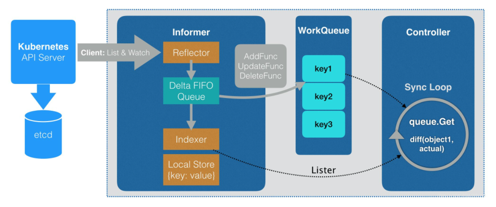
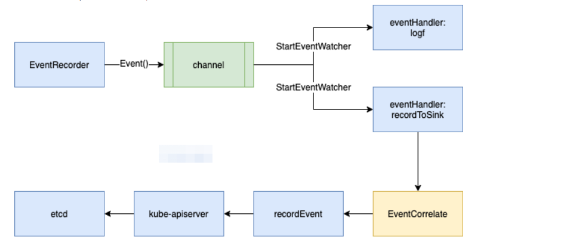

# count
k8s controller demo

## controller
controller的作用就是监听指定对象的新增、删除、修改等变化，针对这些变化做出相应的响应。



如上图，API对象的变化会通过Informer存入队列（WorkQueue），在Controller中消费队列的数据做出响应，响应相关的具体代码就是我们要做的真正业务逻辑。

## 编写一个controller的步骤

1. 创建crd.yaml ，也就是你要想好你的crd到底要干什么

2. 使用code-generator生成client、informers、listers代码

3. 编写controller逻辑

## How to use code-generator

执行 hack/update-codegen.sh 

`update-codegen.sh` 命令含义，

```shell
../vendor/k8s.io/code-generator/generate-groups.sh \
  "deepcopy,client,informer,lister" \
  count/generated \
  count/pkg/apis \
  count:v1 \
  --go-header-file $(pwd)/boilerplate.go.txt \
  --output-base $(pwd)/../../
```

`../vendor/k8s.io/code-generator/generate-groups.sh "deepcopy,client,informer,lister"`: 使用vendor中的shell脚本生成deepcopy,client,informer,lister相关内容

`count/generated`: `${MODULE}/${OUTPUT_PKG}`,`${MODULE}==go.mod中module,${OUTPUT_PKG}` 自己定义的生成代码的包名

`count/pkg/apis`: `${MODULE}/${APIS_PKG},${APIS_PKG}`和apis目录保持一致

`count:v1`: `${GROUP_VERSION}，GROUP==count,VERSION==v1`

## 编译
```shell
go build .
./count -alsologtostderr=true
```
启动后，先后创建 crd和cr资源，然后再删除cr资源

日志情况：
```shell
[root@biz-master-48 count]# ./count -alsologtostderr=true
I0530 07:57:55.721030    4866 controller.go:63] Setting up event handlers
I0530 07:57:55.721432    4866 controller.go:87] 开始controller业务，开始一次缓存数据同步
W0530 07:57:55.732493    4866 reflector.go:324] pkg/mod/k8s.io/client-go@v0.24.1/tools/cache/reflector.go:167: failed to list *v1.Count: the server could not find the requested resource (get counts.demo.mark8s.io)
E0530 07:57:55.732615    4866 reflector.go:138] pkg/mod/k8s.io/client-go@v0.24.1/tools/cache/reflector.go:167: Failed to watch *v1.Count: failed to list *v1.Count: the server could not find the requested resource (get counts.demo.mark8s.io)
W0530 07:57:57.018605    4866 reflector.go:324] pkg/mod/k8s.io/client-go@v0.24.1/tools/cache/reflector.go:167: failed to list *v1.Count: the server could not find the requested resource (get counts.demo.mark8s.io)
E0530 07:57:57.018646    4866 reflector.go:138] pkg/mod/k8s.io/client-go@v0.24.1/tools/cache/reflector.go:167: Failed to watch *v1.Count: failed to list *v1.Count: the server could not find the requested resource (get counts.demo.mark8s.io)
W0530 07:58:00.125599    4866 reflector.go:324] pkg/mod/k8s.io/client-go@v0.24.1/tools/cache/reflector.go:167: failed to list *v1.Count: the server could not find the requested resource (get counts.demo.mark8s.io)
E0530 07:58:00.125639    4866 reflector.go:138] pkg/mod/k8s.io/client-go@v0.24.1/tools/cache/reflector.go:167: Failed to watch *v1.Count: failed to list *v1.Count: the server could not find the requested resource (get counts.demo.mark8s.io)
W0530 07:58:05.454530    4866 reflector.go:324] pkg/mod/k8s.io/client-go@v0.24.1/tools/cache/reflector.go:167: failed to list *v1.Count: the server could not find the requested resource (get counts.demo.mark8s.io)
E0530 07:58:05.454561    4866 reflector.go:138] pkg/mod/k8s.io/client-go@v0.24.1/tools/cache/reflector.go:167: Failed to watch *v1.Count: failed to list *v1.Count: the server could not find the requested resource (get counts.demo.mark8s.io)
W0530 07:58:14.658313    4866 reflector.go:324] pkg/mod/k8s.io/client-go@v0.24.1/tools/cache/reflector.go:167: failed to list *v1.Count: the server could not find the requested resource (get counts.demo.mark8s.io)
E0530 07:58:14.658411    4866 reflector.go:138] pkg/mod/k8s.io/client-go@v0.24.1/tools/cache/reflector.go:167: Failed to watch *v1.Count: failed to list *v1.Count: the server could not find the requested resource (get counts.demo.mark8s.io)
I0530 07:58:33.024376    4866 controller.go:92] worker启动
I0530 07:58:33.024459    4866 controller.go:97] worker已经启动
enqueueCount: obj &{{ } {test-count  default  f702028e-363c-4959-9bc9-bee146b1d746 11980682 1 2022-05-30 07:58:42 +0000 UTC <nil> <nil> map[] map[kubectl.kubernetes.io/last-applied-configuration:{"apiVersion":"demo.mark8s.io/v1","kind":"Count","metadata":{"annotations":{},"name":"test-count","namespace":"default"},"spec":{"count":3,"name":"nginx"}}
] [] []  [{kubectl-client-side-apply Update demo.mark8s.io/v1 2022-05-30 07:58:42 +0000 UTC FieldsV1 {"f:metadata":{"f:annotations":{".":{},"f:kubectl.kubernetes.io/last-applied-configuration":{}}},"f:spec":{".":{},"f:count":{},"f:name":{}}} }]} { 0} {false}}
I0530 07:58:42.136970    4866 controller.go:167] 这里是Count对象的期望状态: &v1.Count{TypeMeta:v1.TypeMeta{Kind:"", APIVersion:""}, ObjectMeta:v1.ObjectMeta{Name:"test-count", GenerateName:"", Namespace:"default", SelfLink:"", UID:"f702028e-363c-4959-9bc9-bee146b1d746", ResourceVersion:"11980682", Generation:1, CreationTimestamp:time.Date(2022, time.May, 30, 7, 58, 42, 0, time.Local), DeletionTimestamp:<nil>, DeletionGracePeriodSeconds:(*int64)(nil), Labels:map[string]string(nil), Annotations:map[string]string{"kubectl.kubernetes.io/last-applied-configuration":"{\"apiVersion\":\"demo.mark8s.io/v1\",\"kind\":\"Count\",\"metadata\":{\"annotations\":{},\"name\":\"test-count\",\"namespace\":\"default\"},\"spec\":{\"count\":3,\"name\":\"nginx\"}}\n"}, OwnerReferences:[]v1.OwnerReference(nil), Finalizers:[]string(nil), ZZZ_DeprecatedClusterName:"", ManagedFields:[]v1.ManagedFieldsEntry{v1.ManagedFieldsEntry{Manager:"kubectl-client-side-apply", Operation:"Update", APIVersion:"demo.mark8s.io/v1", Time:time.Date(2022, time.May, 30, 7, 58, 42, 0, time.Local), FieldsType:"FieldsV1", FieldsV1:(*v1.FieldsV1)(0xc0001b5830), Subresource:""}}}, Spec:v1.CountSpec{name:"", count:0}, Status:v1.CountStatus{healthy:false}} ...
I0530 07:58:42.137272    4866 controller.go:168] 实际状态是从业务层面得到的，此处应该去的实际状态，与期望状态做对比，并根据差异做出响应(新增或者删除)
I0530 07:58:42.137366    4866 controller.go:134] Successfully synced 'default/test-count'
I0530 07:58:42.137926    4866 event.go:285] Event(v1.ObjectReference{Kind:"Count", Namespace:"default", Name:"test-count", UID:"f702028e-363c-4959-9bc9-bee146b1d746", APIVersion:"demo.mark8s.io/v1", ResourceVersion:"11980682", FieldPath:""}): type: 'Normal' reason: 'Synced' Student synced successfully
I0530 07:58:51.462978    4866 controller.go:159] Count对象被删除，请在这里执行实际的删除业务: default/test-count ...
I0530 07:58:51.463008    4866 controller.go:134] Successfully synced 'default/test-count'
^CI0530 07:58:53.802445    4866 controller.go:99] worker已经结束
[root@biz-master-48 count]#
```

## 补充

### k8s日志处理机制
当集群中的 node 或 pod 异常时，大部分用户会使用 kubectl 查看对应的 events，那么 events 是从何而来？ ...

我们可以使用`EventRecorder`为我们创建的自定义资源，添加Event记录，方便排查问题。效果如：
```shell
[root@biz-master-48 crd]# kubectl describe count test-count 
Name:         test-count
Namespace:    default
Labels:       <none>
Annotations:  <none>
API Version:  demo.mark8s.io/v1
Kind:         Count
Metadata:
  Creation Timestamp:  2022-05-30T08:49:40Z
  Generation:          1
  Managed Fields:
    API Version:  demo.mark8s.io/v1
    Fields Type:  FieldsV1
    fieldsV1:
      f:metadata:
        f:annotations:
          .:
          f:kubectl.kubernetes.io/last-applied-configuration:
      f:spec:
        .:
        f:count:
        f:name:
    Manager:         kubectl-client-side-apply
    Operation:       Update
    Time:            2022-05-30T08:49:40Z
  Resource Version:  11989649
  UID:               6e9e998c-e288-443e-ab5f-b70f156f598c
Spec:
  Count:  3
  Name:   nginx
Events:
  Type    Reason  Age   From              Message
  ----    ------  ----  ----              -------
  Normal  Synced  39s   count-controller  Count synced successfully
```

那么如何使用`EventRecorder`呢？ 先看下图



代码逻辑：
```shell
    eventBroadcaster := record.NewBroadcaster()
	eventBroadcaster.StartLogging(glog.Infof)
	eventBroadcaster.StartRecordingToSink(&typeCoreV1.EventSinkImpl{
		Interface: kubeClientSet.CoreV1().Events(""),
	})

	recorder := eventBroadcaster.NewRecorder(scheme.Scheme, coreV1.EventSource{Component: "count-controller"})
    recorder.Event(count, coreV1.EventTypeNormal, "Synced", "Count synced successfully")
```
`eventBroadcaster`是一个事件广播器，通过它提供了StartLogging和StartRecordingToSink两个事件处理函数，分别将event发送给log和apiserver。

NewRecorder创建了recorder实例，它提供了Event方法供事件记录。


### glog
```go
glog.V(4).Info("Creating event broadcaster")
```
glog 可以指定日志的级别，如执行的时候指定 -v=4,此时，日志级别小于或等于 4 的日志将被打印出来

完整的命令如：
```shell
$ ./count -alsologtostderr -v=4
```

### 


## 问题
1.使用vendor
```shell
import _ "k8s.io/code-generator"
```
```shell
go mod vendor
chmod -R 777 vendor
```

## Reference
[k8s自定义controller三部曲之一:创建CRD（Custom Resource Definition）](https://blog.csdn.net/boling_cavalry/article/details/88917818)

[k8s自定义controller三部曲之二:自动生成代码](https://blog.csdn.net/boling_cavalry/article/details/88924194?ops_request_misc=%257B%2522request%255Fid%2522%253A%2522165383645816781685390100%2522%252C%2522scm%2522%253A%252220140713.130102334.pc%255Fblog.%2522%257D&request_id=165383645816781685390100&biz_id=0&utm_medium=distribute.pc_search_result.none-task-blog-2~blog~first_rank_ecpm_v1~rank_v31_ecpm-3-88924194-null-null.nonecase&utm_term=controller&spm=1018.2226.3001.4450)

[k8s自定义controller三部曲之三：编写controller代码](https://blog.csdn.net/boling_cavalry/article/details/88934063)

[使用code-generator生成crd的clientset、informer、listers](https://xieys.club/code-generator-crd/)


